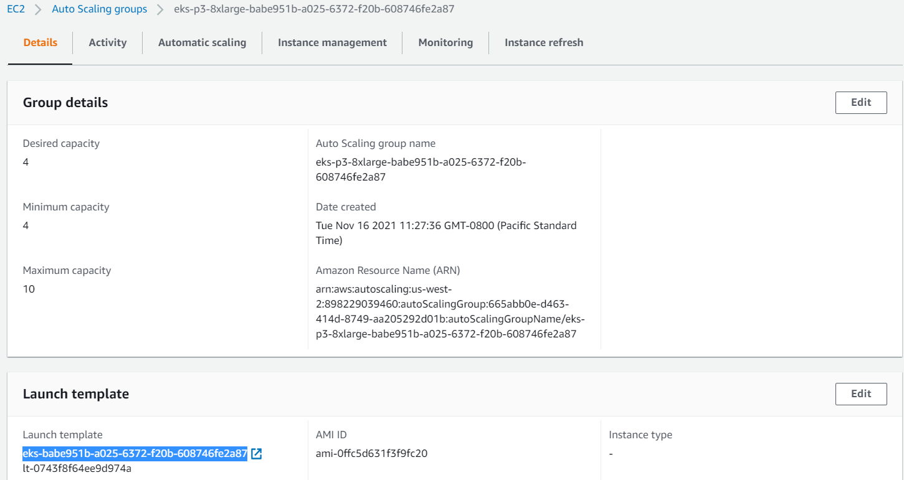

# FSx File System

The FSx for Luster filesystem can only exists in a single AZ and all the nodes using FSx for Luster should be in the same AZ. This can be done my modifying `Network` part of Auto Scaling group of the desired node type from AWS console, and limit it to using only one subnet. 

- Install CSI driver FSx for Luster
    Following script installs csi for the FSx file system:

    `./deploy.sh`

    This script reads in `fsx.conf` file. Before running the script we need to provide the subnet id (line 14) for the AZ in which the FSx is supposed to exist. Also, we need the instance profile name which is the same as the Launch template id. This can be obtained from the relevant Auto Scaling group in EC2 console as shown here: 

    

- Create FSx and persistent volume (Dynamic):

    To create the persistent volume we just need to apply this:

    `kubectl apply -f fsx-pvc-dynamic.yaml`

    This will dynamically provision the FSx filesystem first, which we can verify from the AWS console. Then, it will mount that file system as the persistent volume. If an FSx filesystem already exists, the we need to use the static versions of this yaml.

- Create FSx and persistent volume (Static):

    If the FSx filesystem already exists, the we can use the following yaml to create persistent volume. Before applying this yaml, we need to collect some information about the existing filesystem from AWS FSx console and modify the yaml file accordingly.

    `kubectl apply -f fsx-pvc-static.yaml`

    Note that the existing FSx filesystem must have the same SubnetID as provided in `fsx.conf` because the `deploy.sh` script creates the `storageclass` using that SubnetID, and the same `storageclass` is used in this yaml file.

- Create test pod

    Optionally, we can create a test pos and mount the FSx persistent volume by applying
    
    `kubectl apply -f fsx-share-test.yaml`

- Copy training data to FSx volume

    Assuming that a docker image with `data_prep.sh` script exists, create a pod that will run the `data_prep.sh` script, by applying
    
    `kubectl apply -f fsx-data-prep-pod.yaml`.

    We need to specify the s3 bucket and mount path in this yaml file before creating a pod.

- (Optional) Copy trained model and last checkpoint to S3

    (Note that this is based on the output of TorchElastic model training job.) Assuming that a docker image with `model-save.sh` script exists we can copy the best model and last saved checkpoint to S3 bucket. 
    To run the `model-save.sh` script we just need to create a pod by

    `kubectl apply -f fsx-model-save-pod.yaml`.
    
    We need to provide the s3 bucket in this yaml file where the model needs to saved.
