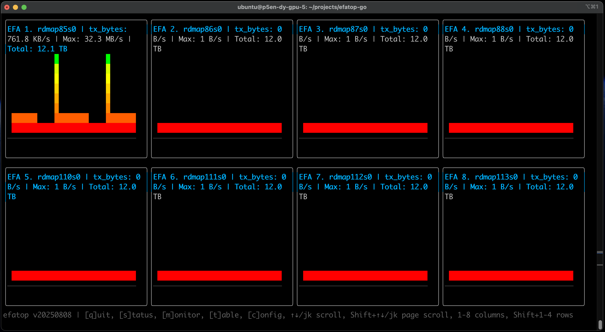

# efatop - EFA Network Utilization Monitor

A text-based user interface (TUI) application for monitoring EFA (Elastic Fabric Adapter) network utilization using hardware counters.

## Features

- Real-time monitoring of EFA adapter network utilization
- Bar charts displaying transmit data rates
- Auto-discovery of EFA adapters from `/sys/class/infiniband`
- Responsive TUI built with bubbletea

<center>

</center>

## Deployment options

### Compile and run locally

```bash
git clone https://github.com/aws-samples/aws-do-eks
cd aws-do-eks/Container-Root/eks/deployment/efatop/go/Container-Root/efatop
go get efatop
go build -o efatop
cp -f ./efatop /usr/bin
```

### Build container image and run locally in Docker

```sh
git clone https://github.com/aws-samples/aws-do-eks
cd aws-do-eks/Container-Root/eks/deployment/efatop/rs
./build.sh
./run.sh
./exec.sh efatop
```

## Build container image and run on Kubernetes

```sh
git clone https://github.com/aws-samples/aws-do-eks
cd aws-do-eks/Container-Root/eks/deployment/efatop/rs
sed -i 's/export TO=docker/export TO=kubernetes/g' .env
./build.sh
./push.sh
./run.sh
```

## Run public container image

```sh
docker run -it --rm --privileged -v /sys/class/infiniband:/sys/class/infiniband -v /sys/devices:/sys/devices -v /dev/infiniband:/dev/infiniband iankoulski/efatop:latest-go efatop
```

## Usage

```bash
sudo ./efatop
```

Note: Root privileges may be required to read hardware counters from `/sys/class/infiniband`.

## Controls

- `q` or `Ctrl+C`: Quit the application
- `s`: switch to status view, showing information about all available EFA adapters
- `m`: switch back to monitoring view with bar graphs
- `t`: switch to table view showing numeric information about the selected counter
- `1-8`: format the screen with the specified number of columns
- `Shift 1-4`: format the screen with the specified number of rows

## Requirements

- Go 1.21+
- EFA adapters with InfiniBand interface
- Access to `/sys/class/infiniband` directory

## License

This project is licensed under the MIT-0 License. See the [LICENSE](LICENSE) file.

## Disclaimer

The metrics provided by this utility are derived from the tx_bytes and other hardware counters from EFA adapters discovered on the local system. These metrics are provided for sanity checking purposes, and are not a substitue for formal performance evaluation and benchmarking.


## Container Project Description
This is a Depend on Docker project which comes operational out of the box
and is configured with reasonable defaults, which can be customized as needed.


The project contains the following scripts:
* `config.sh` - open the configuration file .env in an editor so the project can be customized
* `build.sh` - build the container image
* `test.sh` - run container unit tests
* `push.sh` - push the container image to a registry
* `pull.sh` - pull the container image from a registry
* `run.sh [cmd]` - run the container, passing an argument overrides the default command
* `status.sh` - show container status - running, exited, etc.
* `logs.sh` - tail container logs
* `exec.sh [cmd]` - open a shell or execute a specified command in the running container

