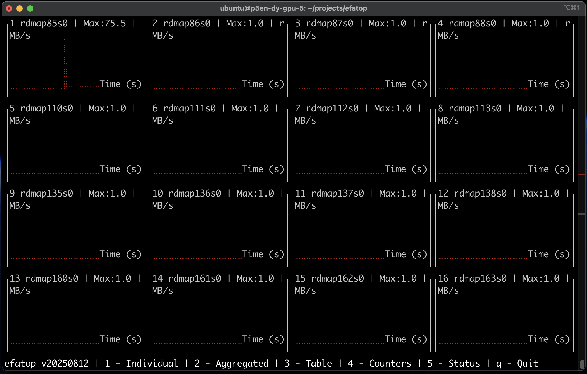

# efatop

A utility to monitor traffic over [Elastic Fabric Adapter](https://docs.aws.amazon.com/AWSEC2/latest/UserGuide/efa.html) or EFA interfaces, available on EFA-enabled Amazon EC2 [instances](https://docs.aws.amazon.com/AWSEC2/latest/UserGuide/efa.html#efa-instance-types)

This Terminal User Interface (TUI) is written in [Rust](https://www.rust-lang.org/), using the [Ratatui](https://ratatui.rs/) library.

<center>

</center>

# Deployment options

## Compile and run locally

```sh
git clone https://github.com/aws-samples/aws-do-eks
cd aws-do-eks/Container-Root/eks/deployment/efatop/rs/Container-Root/efatop
./install-rust.sh
./build.sh
./run.sh
```

## Build container image and run locally

```sh
git clone https://github.com/aws-samples/aws-do-eks
cd aws-do-eks/Container-Root/eks/deployment/efatop/rs
./build.sh
./run.sh
./exec.sh efatop
```

## Build container image and run on Kubernetes

```sh
git clone https://github.com/aws-samples/aws-do-eks
cd aws-do-eks/Container-Root/eks/deployment/efatop/rs
sed -i 's/export TO=docker/export TO=kubernetes/g' .env
./build.sh
./push.sh
./run.sh
```

## Run public container image

```sh
docker run -it --rm --privileged -v /sys/class/infiniband:/sys/class/infiniband -v /sys/devices:/sys/devices -v /dev/infiniband:/dev/infiniband iankoulski/efatop:latest efatop
```

# Container project description


This is a Depend on Docker project which comes operational out of the box 
and is configured with reasonable defaults, which can be customized as needed.


The project contains the following scripts:
* `config.sh` - open the configuration file .env in an editor so the project can be customized
* `build.sh` - build the container image
* `test.sh` - run container unit tests
* `push.sh` - push the container image to a registry
* `pull.sh` - pull the container image from a registry
* `run.sh [cmd]` - run the container, passing an argument overrides the default command
* `status.sh` - show container status - running, exited, etc.
* `logs.sh` - tail container logs
* `exec.sh [cmd]` - open a shell or execute a specified command in the running container
