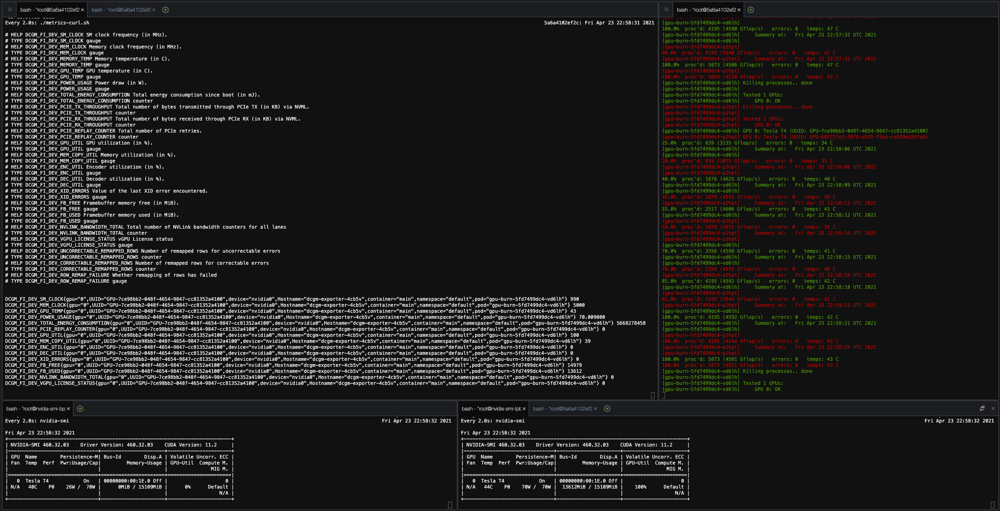

# EKS GPU Load

This repository walks you through deployment of NVIDA's Data Center GPU Manager (DCGM) Exporter for the purpose of monitoring GPU utilization in your EKS cluster.
In addition it provides a way to test that metrics are being collected and reported by generating GPU load periodically and displaying the result on the metrics.

# Prerequisites

This project assumes that you have an EKS cluster with a node group containing at least one g4dn.xlarge instance.
It is also assumed that the GPUs are accessible to pods in the cluster.
If not, the NVIDIA Device Plugin manifest is included in folder deploy/nvidia-device-plugin

# Deploy DCGM Exporter

To deploy dcgm-exporter to your EKS cluster apply the dcgm-exporter.yaml manifest.
A minor modification has been made to this file, compared to the publicly available version linked in the references section below.
This change was needed, in order to enable the DCGM_FI_DEV_GPU_UTIL metric, which is disabled by default.

```
kubectl apply -f dcgm-exporter.yaml
```

To verify that the deployment is successful, list the daemonsets in the kube-system namespace

```
kubectl -n kube-system get ds
```

A line showing that there are as many dcgm-exporter pods as there are g4dn.xlarge nodes in your cluster indicates a successful deployment
```
NAME                             DESIRED   CURRENT   READY   UP-TO-DATE   AVAILABLE   NODE SELECTOR                                  AGE
dcgm-exporter                    2         2         2       2            2           beta.kubernetes.io/instance-type=g4dn.xlarge   29m
```

You should also be able to see the dcgm-exporter service on port 9400

```
kubectl -n kube-system get svc

NAME            TYPE        CLUSTER-IP      EXTERNAL-IP   PORT(S)         AGE
dcgm-exporter   ClusterIP   10.100.80.112   <none>        9400/TCP        31m
```

We will use this service in our test to retrieve the GPU metrics collected by DCGM.

# Test

## Generate alternating load
To generate some load for our test we will use the gpu_burn utility. The provided gpu-burn-deployment.yaml starts two pods,
running one GPU each and executes a recurring load pattern where the GPUs are fully loaded for 20 seconds, then not loaded for 20 seconds.

```
kubectl deploy -f /eks/deploymet/gpu-metrics/gpu-burn-deployment.yaml
```

## Start test pod

This will start a pod from which we will use to query the DCGM API via curl

```
./test/metrics-curl-start.sh
```

## Observe metrics

To get a single read of the DCGM metrics, execute:

```
./test/metrics-curl.sh
```

To observe how the metrics change over time, execute:

```
watch ./test/metrics-curl.sh
```

## Optional observations

In addition, we can observe the gpu-burn pods and the nvidia-smi of each node.

The kubetail utility (see References) allows for simultaneous following of logs from multiple pods.
```
kubetail gpu-burn -n default
```

The nvidia-smi-daemonset.yaml deploys one cuda-dev pod on each of the g4dn.xlarge nodes in your cluster.
You can exec into these pods to see the local GPU Utilization reported by nvidia-smi as needed.
```
kubectl apply -f /eks/deployment/gpu-metrics/nvidia-smi-daemonset.yaml
```
The commands below will display the local GPU utilization in the first available nvidia-smi pod.
To use the 2nd pod change `sed -n 1p` to `sed -n 2p`, etc.
```
kubectl -n default exec -it $(kubectl -n default get pods | grep nvidia-smi | sed -n 1p | cut -d ' ' -f 1) -- bash
watch nvidia-smi
```

Combined you will be able to see GPU utilization information similar to the one displayed in the screenshot below.



Fig.1 - GPU Metrics provided by NVIDIA DCGM

# Cleanup


Remove the gpu_burn deployment to release your GPUs

```
kubectl delete -f /eks/deployment/gpu-metrics/gpu-burn-deployment.yaml
```

Remove the test pod

```
./test/metrics-curl-stop.sh
```

# References

* [NVIDIA DCGM](https://developer.nvidia.com/dcgm)
* [DCGM-Exporter](https://github.com/NVIDIA/gpu-monitoring-tools)
* [dgcm-exporter.yaml](https://github.com/NVIDIA/gpu-monitoring-tools/blob/master/dcgm-exporter.yaml)
* [DCGM Field Identifiers](https://docs.nvidia.com/datacenter/dcgm/latest/dcgm-api/group__dcgmFieldIdentifiers.html#group__dcgmFieldIdentifiers)
* [Kubetail](https://github.com/johanhaleby/kubetail)
