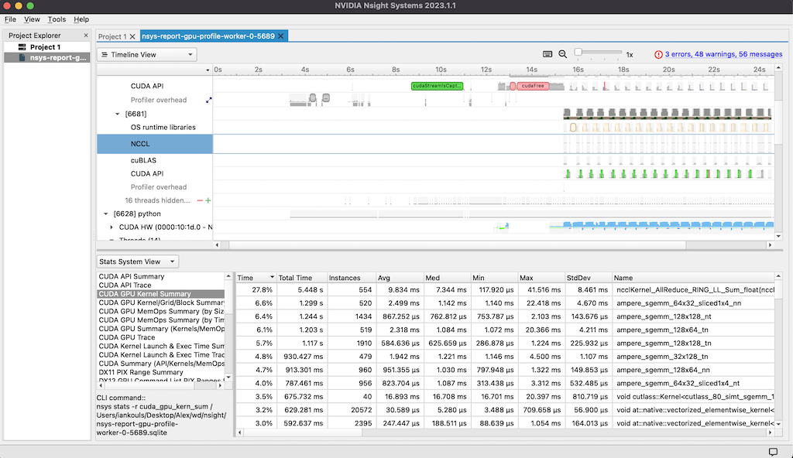

# GPU Profile
This module describes how to run NVIDIA Nsight to profile processes that are running on one or more GPUs on a single node or across multiple nodes.

## Tools
An overview NVIDIA Developer tools is available here: [https://developer.nvidia.com/tools-overview](https://developer.nvidia.com/tools-overview). We use the CLI which comes with either Nsight Systems or Nsight Compute to profile CUDA applications that run on GPUs.

# Process 
To profile a GPU application using the CLI, we run `nsys profile <options>` followed by the normal command that runs the application. In <options> we specify where the profile report should be stored using the `-o <path>` argument. It is preferable the application to have a short run time (typically less than 60 sec) while profiling to avoid the profile reports becoming too big and difficult to analyze. The profile report is automatically generated only when the user application run is complete, regardless of its termination status.

The `nsys` CLI is available in most of NVIDIA's base containers and it can also be installed following the steps in the [`setup.sh`](Container-Root/setup.sh) script of this module. The buld script provided here is configuable and it can be used to create a container image with Nsight and optionaly OpenMPI, EFA, and NCCL tests. 

## Configure
To configure the build, edit file [`.env`](.env). Modify the values of `INSTALL_MPI`, `INSTALL_EFA`, and `INSTALL_TESTS` as needed. EFA install requires that MPI install is enabled. TESTS install requires that EFA install is enabled.

## Build
If you plan to push the container image to a registry, please set the `REGISTRY` value in `.env` first. To build the container image, just execute the `./build.sh` script.

## Push
The `./login.sh` script authenticates your docker client with the configured REGISTRY. If the login does not succeed, please run `aws configure` to provide credentials for your aws CLI. Once the login is successful, execute `./push.sh` to push the container image to the registry.

## Run
The container image can be used locally with docker or deployed to a Kubernetes cluster using kubectl.


To use locally, either clone the project and execute `./run.sh` then `./exec.sh` and `./profile.sh`
or run `./test.sh`
or execute
`docker run --rm -it -v /tmp:/wd  $REGISTRY/$IMAGE$TAG bash` and then run `./profile.sh` within the container.

The container uses an example from Huggingface.co to train a language model using Pytorch DDP.
Once the training process is complete, the profile report will be stored in directory `/tmp` on the host.

To use with a Kubernetes cluster, configure `profile.yaml` with your image uri and desired number of workers, then execute:

```
kubectl apply -f ./profile.yaml
```

This assumes that Kubeflow mpi operator is deployed to the cluster. If not, please execute `/eks/deployment/kubeflow/mpi-operator/deploy.sh`.

Once the job is completed, a report file will be stored in the `/tmp` directory on each of the  nodes in the cluster which ran a worker pod for the job.

## Stop
To remove the standalone container, run `./stop.sh`

To remove the MPIJob from Kubernetes, execute `kubectl delete -f ./profile.yaml`

# Result analysis

## Logs
The logs from the profile run display result tables as the profiling process ends.

## CLI
Report files can be analyzed using the CLI by executing nsys similarly to the following:

```
nsys stats --format table <report_file>.sqlite
``` 

You should see a result similar to the one below:

```text

+---------+-----------------+-----------+--------------+------------+------------+--------------+------------------------------------------------------------------------------------------------------+
| Time(%) | Total Time (ns) | Instances |   Average    |  Minimum   |  Maximum   |    StdDev    |                                                 Name                                                 |
+---------+-----------------+-----------+--------------+------------+------------+--------------+------------------------------------------------------------------------------------------------------+
|    27.8 |   5,448,188,578 |       554 |  9,834,275.4 |    117,920 | 41,516,012 |  8,461,403.0 | ncclKernel_AllReduce_RING_LL_Sum_float(ncclDevComm *, ncclWorkElem)                                  |
|     6.6 |   1,299,270,451 |       520 |  2,498,597.0 |  1,139,864 | 22,418,137 |  4,669,616.6 | ampere_sgemm_64x32_sliced1x4_nn                                                                      |
|     6.4 |   1,243,639,723 |     1,434 |    867,252.2 |    753,787 |  2,102,640 |    143,676.7 | ampere_sgemm_128x128_nt                                                                              |
|     6.1 |   1,203,075,649 |       519 |  2,318,064.8 |  1,071,640 | 20,365,801 |  4,210,734.3 | ampere_sgemm_128x64_tn                                                                               |
|     5.7 |   1,116,655,167 |     1,910 |    584,636.2 |    286,878 |  1,224,475 |    225,932.2 | ampere_sgemm_128x128_tn                                                                              |
|     4.8 |     930,426,814 |       479 |  1,942,435.9 |  1,146,235 |  4,500,333 |  1,106,607.7 | ampere_sgemm_32x128_tn                                                                               |
|     4.7 |     913,301,070 |       960 |    951,355.3 |    797,948 |  1,321,946 |    149,853.7 | ampere_sgemm_128x64_nn                                                                               |
|     4.0 |     787,461,126 |       956 |    823,704.1 |    313,438 |  3,311,537 |    532,485.6 | ampere_sgemm_64x32_sliced1x4_nt                                                                      |
|     3.5 |     675,732,043 |        40 | 16,893,301.1 | 16,701,380 | 20,396,777 |    810,719.4 | void cutlass::Kernel<cutlass_80_simt_sgemm_128x32_8x5_nt_align1>(T1::Params)                         |
|     3.2 |     629,280,885 |    20,572 |     30,589.2 |      3,488 |    709,658 |     56,900.3 | void at::native::vectorized_elementwise_kernel<(int)4, at::native::AUnaryFunctor<float, float, floa… |
|     3.0 |     592,636,882 |     2,395 |    247,447.5 |     88,639 |  1,053,848 |    164,013.9 | void at::native::vectorized_elementwise_kernel<(int)4, at::native::BinaryFunctor<float, float, floa… |
...
```

## UI
Nsight systems comes with a UI which can be downloaded and installed from [NVIDIA's Developer Portal](https://developer.nvidia.com/nsight-systems). A free account registration is required to enable downloads.
The UI is able to open `.nsys-rep` and `.sqlite` files to allow interactive analysis. An example is shown below.

<center>

</center>

