# Custom Metrics-based Pod and Cluster Autoscaling

Presented here, is a technical architecture which allows elastic deployment of services on EKS utilizing efficient autoscaling based on custom metrics. Below are step-by-step instructions for deployment of this architecture throughout its complete lifecycle.

<center>
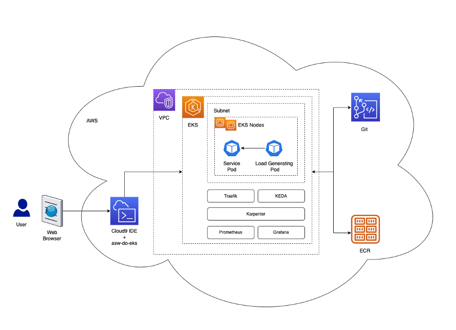<br/>
Fig. 1 - Custom Metrics-based Pod and Cluster Autoscaling Architecture
</center> 
<br/>

The architecture described by Fig. 1 deploys a [simple service](../hpa-example/Dockerfile) in a Kubernetes pod within an [EKS cluster](../../../../../wd/conf/eksctl/yaml/eks-karpenter.yaml). The service is exposed behind a reverse-proxy using [Traefik](https://github.com/traefik/traefik). The reverse proxy collects metrics about calls to the service and exposes them via a standard metrics API to [Prometheus](https://github.com/prometheus/prometheus). The Kubernetes Event-driven Autoscaler ([KEDA](https://github.com/kedacore/keda)) is configured to automatically scale the number of service pods, based on the number of requests per second as a custom metric. Karpenter monitors for any pending pods. If pods are pending due to lack of sufficient resources in the cluster, then Karpenter adds more nodes so all pods can run. If there are more nodes in the cluster then what the scheduled pods require, then Karpenter removes nodes and the pods get consolidated. The number of HTTP requests per second and number of nodes can be visualized using a [Grafana](https://github.com/grafana/grafana) dashboard. To generate load we use a [simple pod](../hpa-example/load-generator.yaml) which sends HTTP requests to the service using [curl](https://github.com/curl/curl).

In this walkthrough we use [AWS Cloud9](https://aws.amazon.com/pm/cloud9/) to enable all steps to be completed in a browser. The same steps can be completed from the reader's local computer, or from an Amazon EC2 instance.

# 0. Prerequisites
For simplicity, the architecture was purposely designed with a minimal set of prerequisites.
1. [Git](https://git-scm.com/downloads)
2. [Docker](https://docs.docker.com/get-docker)
3. [AWS CLI](https://docs.aws.amazon.com/cli/latest/userguide/getting-started-install.html)

# 1. Set up EKS environment
## 1.1. Configure AWS CLI
If you are using an EC2 instance role, you may skip configuring your CLI since the permissions of your AWS client will be inherited from your EC2 instance. 

If you are using AWS Cloud9, please ensure that the “AWS managed temporary credentials” setting is disabled by visiting Cloud9 -> Preferences and selecting "AWS Settings" as shown below.

<center>
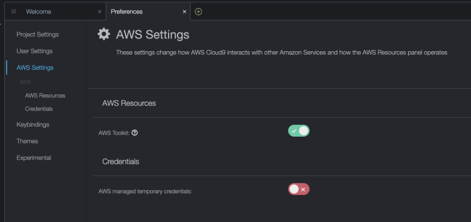<br/>
Fig. 2 - AWS Settings in Cloud9
</center>
<br/>

To set your Access Key ID and Secret Access Key, please run the command below:

```bash
aws configure
```
<details>
    <summary>Example:</summary>
    
    ~ $ aws configure
    AWS Access Key ID [****************ABC1]:
    AWS Secret Access Key [****************adb6]:
    Default region name [us-west-2]:
    Default output format [json]:

</details>

<br/>
Paste your AWS Access Key ID and Secret Access Key when prompted, then specify your desired AWS region and enter `json` as default output format.

## 1.2. Clone the [aws-do-eks](https://github.com/aws-samples/aws-do-eks) project
Clone the project repository as shown below:

```bash
git clone https://github.com/aws-samples/aws-do-eks
```

## 1.3. Build the `aws-do-eks` container

```bash
cd aws-do-eks
./build.sh
```

<details>
    <summary>Output:</summary>

    ~/environment/aws-do-eks (main) $ ./build.sh 
    Sending build context to Docker daemon  30.56MB
    Step 1/11 : FROM ubuntu:20.04
    ---> 14be0685b768
    Step 2/11 : ARG http_proxy
    ---> Using cache
    ---> 194993474db1
    Step 3/11 : ARG https_proxy
    ---> Using cache
    ---> 8a240cfc049b
    Step 4/11 : ARG no_proxy
    ---> Using cache
    ---> 6fa3a2bf3285
    Step 5/11 : ENV DEBIAN_FRONTEND=noninteractive
    ---> Using cache
    ---> 8b3067251c60
    Step 6/11 : ENV AWS_PAGER=""
    ---> Using cache
    ---> b84db3dcafb3
    Step 7/11 : ADD Container-Root /
    ---> Using cache
    ---> 6290745dc8c4
    Step 8/11 : ADD wd/conf/ /eks/conf/
    ---> Using cache
    ---> b5cdc32106ac
    Step 9/11 : RUN export http_proxy=$http_proxy; export https_proxy=$https_proxy; export no_proxy=$no_proxy; /setup.sh; rm -f /setup.sh
    ---> Running in 570984ad799b
    Get:1 http://archive.ubuntu.com/ubuntu focal InRelease [265 kB]
    Get:2 http://security.ubuntu.com/ubuntu focal-security InRelease [114 kB]
    Get:3 http://security.ubuntu.com/ubuntu focal-security/main amd64 Packages [2906 kB]
    ...
    Step 10/11 : WORKDIR /eks
    ---> Running in f9a6638b2b75
    Removing intermediate container f9a6638b2b75
    ---> 713b8e56435e
    Step 11/11 : CMD /startup.sh
    ---> Running in 646ba315cae5
    Removing intermediate container 646ba315cae5
    ---> 563aea707b85
    Successfully built 563aea707b85
    Successfully tagged xxxxxxxxxxxx.dkr.ecr.us-west-2.amazonaws.com/aws-do-eks:v20230524

</details>
<br/>

## 1.4. Run `aws-do-eks` container

```bash
./run.sh
```

<details>
    <summary>Output:</summary>

    $ ./run.sh 
    babbe0a55e9246b11c7e06b89f67e34168f88bc5a84e9ccd42d4b5b260389919
    $

</details>
<br/>

Note: Any existing cluster context from your local host located in `${HOME}/kube/config` will be mounted inside the container when it runs.

## 1.5. Open a shell into the container

```bash
./exec.sh
```

<details>
    <summary>Output:</summary>

    root@babbe0a55e92:/eks#

</details>
<br/>

## 1.6. Configure environment

You may skip this step if you already have an EKS cluster.

```bash
./env-config.sh
```

Change line:

`export CONF=conf/eksctl/yaml/eks.yaml`

to

`export CONF=conf/eksctl/yaml/eks-karpenter.yaml`

then save and exit the configuration by pressing `Esc`, and typing `:wq`.

The cluster manifest we configured is shown below:

```yaml
# Reference: https://eksctl.io/usage/eksctl-karpenter/

apiVersion: eksctl.io/v1alpha5
kind: ClusterConfig

metadata:
  name: do-eks-yaml-karpenter
  version: "1.28"
  region: us-west-2
  tags:
    karpenter.sh/discovery: do-eks-yaml-karpenter

iam:
  withOIDC: true

addons:
  - name: aws-ebs-csi-driver
    version: v1.26.0-eksbuild.1
    wellKnownPolicies:
      ebsCSIController: true

managedNodeGroups:
  - name: c5-xl-do-eks-karpenter-ng
    instanceType: c5.xlarge
    instancePrefix: c5-xl
    privateNetworking: true
    minSize: 0
    desiredCapacity: 2
    maxSize: 10
    volumeSize: 300
    iam:
      withAddonPolicies:
        cloudWatch: true
        ebs: true
```

The manifest defines an EKS cluster version `1.28`. It has a managed node group of c5.xlarge instance type nodes which is used to run system pods like coredns and karpenter. We will deploy Karpenter after the cluster has been created.

## 1.7. Create EKS cluster

You may skip this step if you are using a pre-existing EKS cluster.

```bash
./eks-create.sh
```

This script will execute `eksctl create cluster -f ./conf/eksctl/yaml/eks-karpenter.yaml`

Note: The process of creating an EKS cluster takes around 20 minutes.

<details>
    <summary>Output:</summary>

    2023-07-25 15:09:08 [ℹ]  eksctl version 0.150.0
    2023-07-25 15:09:08 [ℹ]  using region us-west-2
    2023-07-25 15:09:08 [ℹ]  setting availability zones to [us-west-2a us-west-2d us-west-2c]
    2023-07-25 15:09:08 [ℹ]  subnets for us-west-2a - public:192.168.0.0/19 private:192.168.96.0/19
    2023-07-25 15:09:08 [ℹ]  subnets for us-west-2d - public:192.168.32.0/19 private:192.168.128.0/19
    2023-07-25 15:09:08 [ℹ]  subnets for us-west-2c - public:192.168.64.0/19 private:192.168.160.0/19
    2023-07-25 15:09:08 [ℹ]  nodegroup "c5-xl-do-eks-karpenter-ng" will use "" [AmazonLinux2/1.28]
    2023-07-25 15:09:08 [ℹ]  using Kubernetes version 1.28
    2023-07-25 15:09:08 [ℹ]  creating EKS cluster "do-eks-yaml-karpenter" in "us-west-2" region with managed nodes
    ...

    2023-07-25 15:20:56 [ℹ]  kubectl command should work with "/root/.kube/config", try 'kubectl get nodes'
    2023-07-25 15:21:36 [✔]  EKS cluster "do-eks-yaml-karpenter" in "us-west-2" region is ready

    Done creating cluster using /eks/conf/eksctl/yaml/eks-karpenter.yaml

</details>
<br/>

## 1.8. Deploy Karpenter

You may edit /eks/deployment/karpenter/karpenter.conf to set deployment options for Karpenter, if you would like them to be different than the pre-set ones. Then execute the `deploy.sh` script as shown below. The script automates the instructions, provided in the Karpenter documentation [here](https://karpenter.sh/docs/getting-started/getting-started-with-karpenter/#4-install-karpenter).

```bash
pushd /eks/deployment/karpenter
./deploy.sh
popd
```

<details>
    <summary>Output:</summary>

    # ./deploy.sh  

    Configuration: 

    KARPENTER_NAMESPACE=karpenter
    KARPENTER_VERSION=v0.32.4
    K8S_VERSION=1.28
    CLUSTER_NAME=do-eks-yaml-karpenter
    AWS_DEFAULT_REGION=us-west-2
    AWS_ACCOUNT_ID=159553542841
    TEMPOUT=/tmp/tmp.9buJBCovu5


    Creating Karpenter NodeRole, ControllerPolicy, InterruptionQueue, InterruptionQueuePolicy, and Rules using CloudFormation ...

    Waiting for changeset to be created..
    Waiting for stack create/update to complete
    Successfully created/updated stack - Karpenter-do-eks-yaml-karpenter

    Creating IAM Identity Mapping so Karpenter instances can connect to the cluster ...
    2024-01-05 17:19:48 [ℹ]  checking arn arn:aws:iam::159553542841:role/KarpenterNodeRole-do-eks-yaml-karpenter against entries in the auth ConfigMap
    2024-01-05 17:19:48 [ℹ]  adding identity "arn:aws:iam::159553542841:role/KarpenterNodeRole-do-eks-yaml-karpenter" to auth ConfigMap

    Creating KarpenterController IAM Role ...
    2024-01-05 17:19:49 [ℹ]  1 existing iamserviceaccount(s) (kube-system/aws-node) will be excluded
    2024-01-05 17:19:49 [ℹ]  1 iamserviceaccount (karpenter/karpenter) was included (based on the include/exclude rules)
    2024-01-05 17:19:49 [!]  serviceaccounts in Kubernetes will not be created or modified, since the option --role-only is used
    2024-01-05 17:19:49 [ℹ]  1 task: { create IAM role for serviceaccount "karpenter/karpenter" }
    2024-01-05 17:19:49 [ℹ]  building iamserviceaccount stack "eksctl-do-eks-yaml-karpenter-addon-iamserviceaccount-karpenter-karpenter"
    2024-01-05 17:19:49 [ℹ]  deploying stack "eksctl-do-eks-yaml-karpenter-addon-iamserviceaccount-karpenter-karpenter"
    2024-01-05 17:19:49 [ℹ]  waiting for CloudFormation stack "eksctl-do-eks-yaml-karpenter-addon-iamserviceaccount-karpenter-karpenter"
    2024-01-05 17:20:19 [ℹ]  waiting for CloudFormation stack "eksctl-do-eks-yaml-karpenter-addon-iamserviceaccount-karpenter-karpenter"

    CLUSTER_ENDPOINT=https://13978949D1AA818CB963F2FFF0DD1CFA.gr7.us-west-2.eks.amazonaws.com
    KARPENTER_IAM_ROLE_ARN=arn:aws:iam::159553542841:role/do-eks-yaml-karpenter-karpenter


    Enabling spot ...

    It is ok to see an error here if the service linked role already exists

    An error occurred (InvalidInput) when calling the CreateServiceLinkedRole operation: Service role name AWSServiceRoleForEC2Spot has been taken in this account, please try a different suffix.


    It is ok to see an error here if helm is not logged in to public.ecr.aws
    Error: not logged in

    Installing Karpenter using helm ...
    Release "karpenter" does not exist. Installing it now.
    Pulled: public.ecr.aws/karpenter/karpenter:v0.32.4
    Digest: sha256:b733abfbaf897937e775adb55e7906dbd0b7abc64a6c9e37479f09b376edc7f7
    NAME: karpenter
    LAST DEPLOYED: Fri Jan  5 17:20:22 2024
    NAMESPACE: karpenter
    STATUS: deployed
    REVISION: 1
    TEST SUITE: None
    NAME                         READY   STATUS    RESTARTS   AGE
    karpenter-789c779866-rdcp4   1/1     Running   0          12s
    karpenter-789c779866-skwvz   1/1     Running   0          12s
    #

</details>
<br/>

## 1.9. Verify cluster 

```bash
kubectl get pods -A
```

You should see a number of running pods in the `kube-system` namespace as well as karpenter pods in the karpenter namespace.

<details>
    <summary>Output:</summary>

    root@cbcc176f4f98:/eks/deployment/karpenter# kubectl get pods -A
    NAMESPACE     NAME                        READY   STATUS    RESTARTS   AGE
    karpenter     karpenter-b5ff789bf-hnfb6   1/1     Running   0          5h47m
    karpenter     karpenter-b5ff789bf-pbbvc   1/1     Running   0          5h47m
    kube-system   aws-node-brq2d              1/1     Running   0          5h53m
    kube-system   aws-node-dq7wm              1/1     Running   0          5h53m
    kube-system   coredns-67f8f59c6c-9g7dr    1/1     Running   0          6h
    kube-system   coredns-67f8f59c6c-krm8c    1/1     Running   0          6h
    kube-system   kube-proxy-lntsq            1/1     Running   0          5h53m
    kube-system   kube-proxy-nvvfh            1/1     Running   0          5h53m

</details>

## 1.9. Create Karpenter NodePool and EC2NodeClass

From the `aws-do-eks` container shell run:

```bash
pushd /eks/deployment/karpenter
./provisioner-deploy-v1beta1.sh
popd
```

<details>
    <summary>Output:</summary>

    # pushd /eks/deployment/karpenter
    /eks/deployment/karpenter /eks
    # ./provisioner-deploy-v1beta1.sh
    CLUSTER_NAME=do-eks-yaml-karpenter
    nodepool.karpenter.sh/default created
    ec2nodeclass.karpenter.k8s.aws/default created
    # popd
    /eks

</details>
<br/>

Let’s look into how the Karpenter configuration was created. The script generated the following two manifests:

```yaml
apiVersion: karpenter.sh/v1beta1
kind: NodePool
metadata:
  name: default
spec:
  template:
    metadata:
      labels:
        cluster-name: $CLUSTER_NAME
      annotations:
        purpose: "karpenter-example"
    spec:
      nodeClassRef:
        apiVersion: karpenter.k8s.aws/v1beta1
        kind: EC2NodeClass
        name: default
      requirements:
        - key: "karpenter.sh/capacity-type"
          operator: In
          values: ["spot", "on-demand"]
        - key: "karpenter.k8s.aws/instance-category"
          operator: In
          values: ["c", "m", "r", "g", "p"]
        - key: "karpenter.k8s.aws/instance-generation"
          operator: Gt
          values: ["2"]
  disruption:
    consolidationPolicy: WhenUnderutilized
    #consolidationPolicy: WhenEmpty
    #consolidateAfter: 30s
    expireAfter: 720h
---
apiVersion: karpenter.k8s.aws/v1beta1
kind: EC2NodeClass
metadata:
  name: default
spec:
  amiFamily: AL2
  subnetSelectorTerms:
    - tags:
        karpenter.sh/discovery: "${CLUSTER_NAME}"
  securityGroupSelectorTerms:
    - tags:
        karpenter.sh/discovery: "${CLUSTER_NAME}"
  role: "KarpenterNodeRole-${CLUSTER_NAME}"
  tags:
    app: autoscaling-test
  blockDeviceMappings:
    - deviceName: /dev/xvda
      ebs:
        volumeSize: 80Gi
        volumeType: gp3
        iops: 10000
        deleteOnTermination: true
        throughput: 125
  detailedMonitoring: true
``` 

Among other settings, the EC2NodeClass is used to specify that provisioned nodes should have an 80Gi volume attached. This is necessary, because if the volume is too small, it may run out of space when running pods from larger container images.
The NodePool manifest, instructs Karpenter to use spot or on-demand instances within the specified instance families when adding new nodes to the cluster.

## 1.10. Deploy EBS CSI Controller

If you created the cluster using the provided manifest, the EBS CSI Controller is already deployed and you may skip this step. You can check if EBS CSI is deployed to your cluster by running `kubectl get pods -A | grep ebs-csi`.

This Container Storage Interface (CSI) controller is needed to enable use of EBS volumes from the Kubernetes cluster. EBS volumes are needed by some of the tools we’ll use later. If you are using a pre-existing EKS cluster where the EBS CSI Controller is not deployed, you can follow the instructions below to deploy the open-source self-managed version of the CSI controller. Amazon EKS also offers this deployment as a manged add-on described [here](https://docs.aws.amazon.com/eks/latest/userguide/managing-ebs-csi.html).

```bash
pushd /eks/deployment/csi/ebs
./deploy.sh
popd
```

<details>
    <summary>Output:</summary>

    /eks# pushd /eks/deployment/csi/ebs
    /eks/deployment/csi/ebs /eks
    /eks/deployment/csi/ebs# ./deploy.sh 
    serviceaccount/ebs-csi-controller-sa created
    serviceaccount/ebs-csi-node-sa created
    clusterrole.rbac.authorization.k8s.io/ebs-csi-node-role created
    clusterrole.rbac.authorization.k8s.io/ebs-external-attacher-role created
    clusterrole.rbac.authorization.k8s.io/ebs-external-provisioner-role created
    clusterrole.rbac.authorization.k8s.io/ebs-external-resizer-role created
    clusterrole.rbac.authorization.k8s.io/ebs-external-snapshotter-role created
    clusterrolebinding.rbac.authorization.k8s.io/ebs-csi-attacher-binding created
    clusterrolebinding.rbac.authorization.k8s.io/ebs-csi-node-getter-binding created
    clusterrolebinding.rbac.authorization.k8s.io/ebs-csi-provisioner-binding created
    clusterrolebinding.rbac.authorization.k8s.io/ebs-csi-resizer-binding created
    clusterrolebinding.rbac.authorization.k8s.io/ebs-csi-snapshotter-binding created
    deployment.apps/ebs-csi-controller created
    poddisruptionbudget.policy/ebs-csi-controller created
    daemonset.apps/ebs-csi-node created
    csidriver.storage.k8s.io/ebs.csi.aws.com created
    /eks/deployment/csi/ebs# popd
    /eks

</details>

# 2. Deploy tools to cluster

## 2.1. Traefik - reverse proxy

From the `aws-do-eks` container shell run:

```bash
pushd /eks/deployment/traefik
./deploy.sh
popd
```

<details>
    <summary>Output:</summary>

    /eks# pushd /eks/deployment/traefik
    /eks/deployment/traefik /eks
    /eks/deployment/traefik# ./deploy.sh 
    namespace/traefik created
    "traefik" has been added to your repositories
    Hang tight while we grab the latest from your chart repositories...
    ...Successfully got an update from the "traefik" chart repository
    Update Complete. ⎈Happy Helming!⎈
    NAME: traefik
    LAST DEPLOYED: Wed Aug  2 15:20:35 2023
    NAMESPACE: traefik
    STATUS: deployed
    REVISION: 1
    TEST SUITE: None
    NOTES:
    Traefik Proxy v2.10.6 has been deployed successfully on traefik namespace !
    /eks/deployment/traefik# popd
    /eks

</details>
<br/>

## 2.2. KEDA

From the `aws-do-eks` container shell run:

```bash
pushd /eks/deployment/horizontal-pod-autoscaler/keda
./deploy.sh
popd
```
	
<details>
    <summary>Output:</summary>

    /eks# pushd /eks/deployment/horizontal-pod-autoscaler/keda
    /eks/deployment/horizontal-pod-autoscaler/keda /eks
    /eks/deployment/horizontal-pod-autoscaler/keda# ./deploy.sh
    "kedacore" has been added to your repositories
    Hang tight while we grab the latest from your chart repositories...
    ...Successfully got an update from the "kedacore" chart repository
    ...Successfully got an update from the "traefik" chart repository
    Update Complete. ⎈Happy Helming!⎈
    namespace/keda created
    NAME: keda
    LAST DEPLOYED: Wed Aug  2 15:24:08 2023
    NAMESPACE: keda
    STATUS: deployed
    REVISION: 1
    TEST SUITE: None
    .Kubernetes Event-driven Autoscaling (KEDA) - Application autoscaling made simple.

    Get started by deploying Scaled Objects to your cluster:
        - Information about Scaled Objects : https://keda.sh/docs/latest/concepts/
        - Samples: https://github.com/kedacore/samples

    Get information about the deployed ScaledObjects:
    kubectl get scaledobject [--namespace <namespace>]

    Get details about a deployed ScaledObject:
    kubectl describe scaledobject <scaled-object-name> [--namespace <namespace>]

    Get information about the deployed ScaledObjects:
    kubectl get triggerauthentication [--namespace <namespace>]

    Get details about a deployed ScaledObject:
    kubectl describe triggerauthentication <trigger-authentication-name> [--namespace <namespace>]

    Get an overview of the Horizontal Pod Autoscalers (HPA) that KEDA is using behind the scenes:
    kubectl get hpa [--all-namespaces] [--namespace <namespace>]

    Learn more about KEDA:
    - Documentation: https://keda.sh/
    - Support: https://keda.sh/support/
    - File an issue: https://github.com/kedacore/keda/issues/new/choose
    /eks/deployment/horizontal-pod-autoscaler/keda# popd
    /eks

</details>
<br/>

## 2.3. Prometheus & Grafana

### 2.3.1. Deploy

From the `aws-do-eks` container run:

```bash
pushd /eks/deployment/prometheus-grafana
./deploy.sh
popd
```

<details>
    <summary>Output:</summary>


    /eks# pushd /eks/deployment/prometheus-grafana
    /eks/deployment/prometheus-grafana /eks
    /eks/deployment/prometheus-grafana# ./deploy.sh
    "prometheus-community" has been added to your repositories
    "grafana" has been added to your repositories
    namespace/prometheus created
    NAME: prometheus
    LAST DEPLOYED: Wed Aug  2 15:29:29 2023
    NAMESPACE: prometheus
    STATUS: deployed
    REVISION: 1
    TEST SUITE: None
    NOTES:
    The Prometheus server can be accessed via port 80 on the following DNS name from within your cluster:
    prometheus-server.prometheus.svc.cluster.local
    ...
    namespace/grafana created
    NAME: grafana
    LAST DEPLOYED: Wed Aug  2 15:29:33 2023
    NAMESPACE: grafana
    STATUS: deployed
    REVISION: 1
    NOTES:
    1. Get your 'admin' user password by running:
    kubectl get secret --namespace grafana grafana -o jsonpath="{.data.admin-password}" | base64 --decode ; echo
    2. The Grafana server can be accessed via port 80 on the following DNS name from within your cluster:
    grafana.grafana.svc.cluster.local
    ...
    /eks/deployment/prometheus-grafana# popd
    /eks

</details>
<br/>

### 2.3.2. Expose Grafana UI
There are a few possible ways to expose a web application running on Kubernetes and you may choose your own preferred method. For simplicity we will use kubectl port-forwarding.

To expose the Grafana UI in a new `aws-do-eks` shell run: 

```bash
pushd /eks/deployment/prometheus-grafana
./expose-grafana.sh
popd
```

<details>
    <summary>Output:<\summary>

    root@ef15cb4b4d4a:/eks# pushd /eks/deployment/prometheus-grafana
    /eks/deployment/prometheus-grafana /eks
    root@ef15cb4b4d4a:/eks/deployment/prometheus-grafana# ./expose-grafana.sh 

    If you are in a Cloud9 environment, the Grafana dashboard is available via the following URL:
    REGION=ef15cb4b4d4a
    https://.vfs.cloud9.ef15cb4b4d4a.amazonaws.com/login

    If you are port-forwarding from a local machine, the Grafana dashboard is available via the following URL:
    http://localhost:8080
    root@ef15cb4b4d4a:/eks/deployment/prometheus-grafana# Forwarding from 0.0.0.0:8080 -> 3000
    Handling connection for 8080

    root@ef15cb4b4d4a:/eks/deployment/prometheus-grafana# popd
    /eks
    root@ef15cb4b4d4a:/eks#

</details>
<br/>

You can check if the port forwarding process is running by executing: `ps -aef | grep port-forward`. While this process is running, you may access the Grafana UI at:

[http://localhost:8080](http://localhost:8080)

### 2.3.3. Login to the Grafana UI
Inside the `aws-do-eks` container in directory /eks/deployment/prometheus-grafana, use the `./auth.sh` script to retrieve the password for logging in to the Grafana UI.

```bash
pushd /eks/deployment/prometheus-grafana
./auth.sh
popd
```

<details>
    <summary>Output:</summary>


    /eks/deployment/prometheus-grafana /eks
    root@0b227152a5dc:/eks/deployment/prometheus-grafana# ./auth.sh
    actual_password_here
    root@0b227152a5dc:/eks/deployment/prometheus-grafana# popd
    /eks

</details>
<br/>

Navigate to [http://localhost:8080](http://localhost:8080) in your browser. The Grafana login page should load. Enter user name `admin` and the password provided by `./auth.sh` to authenticate.

<center>
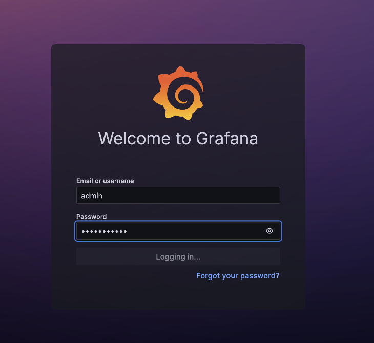<br/>
Fig. 3 - Grafana UI Login
</center>
<br/>

Upon successful login, you will see the Grafana home page.

<center>
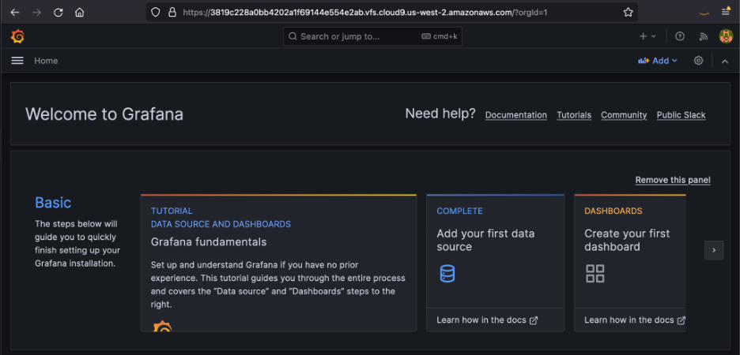<br/>
Fig. 4 - Grafana Home Page
</center>
<br/>

### 2.3.4. Import Cluster Autoscaling Dashboard

To import the autoscaling dashboard, please navigate to Home->Dashboards, then pull-down the “New” button and select “Import”.

<center>
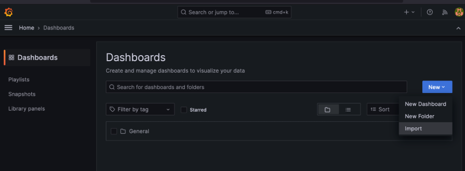<br/>
Fig. 5 - Import Dashboard Navigation
</center>
<br/>

Download the [autoscaling grafna dashboard](../hpa-example/grafana-dashboard.json) locally, then import it by uploading the local file as shown in Fig. 6.

<center>
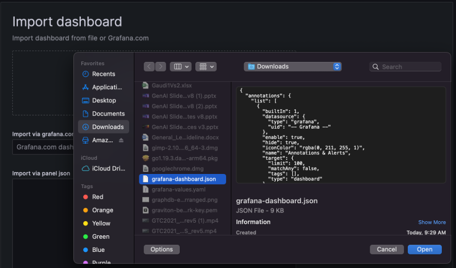<br/>
Fig. 6 - Import Grafana Dashboard
</center>
<br/>

Click the "Import" button and you will see the initial Cluster Autoscaling Dashboard (Fig. 7)
<center>
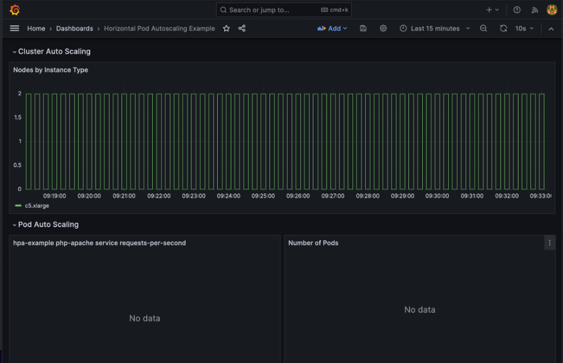<br/>
Fig. 7 - Cluster Autoscaling Dashboard
</center>
<br/>

# 3. Run scale experiment

To set up the scale experiment will deploy a simple PHP service hosted in Apache HTTP server behind a Traefik reverse-proxy. We will use KEDA to monitor and autoscale the number of pods for this service based on the rate of requests it receives. We will deploy a number of pods which send requests to the service. We will increase the load by increasing the number of load-generating pods. As we scale the load up we will observe the number of service pods increase. When there are not enough nodes to run the service pods, Karpenter will automatically add more nodes to the cluster.
To complete this experiment, follow the steps below:

## 3.1. Build service container and push it to your private container registry

```bash
pushd /eks/deployment/horizontal-pod-autoscaler/hpa-example
./build.sh
./push.sh
popd
```

<details>
    <summary>Output:</summary>

    /eks# pushd /eks/deployment/horizontal-pod-autoscaler/hpa-example
    /eks/deployment/horizontal-pod-autoscaler/hpa-example /eks
    /eks/deployment/horizontal-pod-autoscaler# ./build.sh
    => [1/4] FROM
    ... 
    => [2/4] COPY index.php /var/www/html/index.php                                                                                                                                                           2.0s
    => [3/4] RUN mkdir -p /var/www/html/php-apache; ln -s /var/www/html/index.php /var/www/html/php-apache/index.php; mkdir -p /var/www/html/hpa-example; ln -s /var/www/html/index.php /var/www/html/hpa-ex  0.6s
    => [4/4] RUN chmod a+rx index.php                                                                                                                                                                         0.6s
    => exporting to image                                                                                                                                                                                     0.1s
    => => exporting layers                                                                                                                                                                                    0.0s
    => => writing image sha256:0b7d1241c011116a9c14833f201ebb80de91206fce14824559ed4eb906f7be17                                                                                                               0.0s
    ...
    /eks/deployment/horizontal-pod-autoscaler/hpa-example# ./push.sh 
    ...
    Login Succeeded
    ...
    224465a7fa05: Pushed 
    8f3dcbaaf41f: Pushed 
    ...
    latest: digest: sha256:f0b538696bae610ba92f60926b4fc419537e4ccb512ce0608578ee85fa487740 size: 3656
    /eks/deployment/horizontal-pod-autoscaler/hpa-example# popd
    /eks

</details>
<br/>

## 3.2. Deploy service

```bash
pushd /eks/deployment/horizontal-pod-autoscaler/hpa-example/
./run.sh
```

<details>
    <summary>Output:</summary>

    /eks#pushd /eks/deployment/horizontal-pod-autoscaler/hpa-example/
    /eks/deployment/horizontal-pod-autoscaler/hpa-example /eks
    /eks/deployment/horizontal-pod-autoscaler/hpa-example# ./run.sh 

    Generating manifest from template php-apache.yaml-template ...

    Applying base manifests ...
    namespace/hpa-example created
    deployment.apps/php-apache created
    service/php-apache created

</details>
<br/>

## 3.3. Check status

```bash
./status.sh
```

<details>
    <summary>Output:</summary>

    /eks/deployment/horizontal-pod-autoscaler/hpa-example# ./status.sh 

    Showing hpa-example status ...
    NAME                             READY   STATUS    RESTARTS   AGE
    pod/php-apache-fc7ff7cdb-jnbrr   1/1     Running   0          8m47s

    NAME                 TYPE        CLUSTER-IP     EXTERNAL-IP   PORT(S)   AGE
    service/php-apache   ClusterIP   10.100.60.16   <none>        80/TCP    8m47s

    NAME                         READY   UP-TO-DATE   AVAILABLE   AGE
    deployment.apps/php-apache   1/1     1            1           8m47s

    NAME                                   DESIRED   CURRENT   READY   AGE
    replicaset.apps/php-apache-fc7ff7cdb   1         1         1       8m47s

</details>
<br/>

## 3.4. Create Ingress

```bash
kubectl apply -f ./ingress.yaml
```

<details>
    <summary>Output:</summary>

    /eks/deployment/horizontal-pod-autoscaler/hpa-example# kubectl apply -f ./ingress.yaml
    ingress.networking.k8s.io/php-apache-ingress created

</details>
<br/>

<!--
## 3.4. Alternatively Create Traefik Ingress Route
Note: If using a Traefik Ingress Route instead of Kubernetes Ingress, the name of the service
in the rate panel of the dashboard will need to be selected to reflect the Traefik-specific route name.

```bash
kubectl apply -f ./ingressroute.yaml
```

<details>
    <summary>Output:</summary>

    /eks/deployment/horizontal-pod-autoscaler/hpa-example# kubectl apply -f ./ingressroute.yaml 
    ingressroute.traefik.containo.us/ingressroute-apache created

</details>
-->

## 3.5. Deploy KEDA Scaled Object

We are going to apply the following KEDA Scaled Object manifest to the cluster:

```yaml
apiVersion: keda.sh/v1alpha1
kind: ScaledObject
metadata:
  name: keda-prometheus-hpa
  namespace: hpa-example
spec:
  scaleTargetRef:
    name: php-apache
  minReplicaCount:  1 
  cooldownPeriod:   30
  triggers:
  - type: prometheus
    metadata:
      serverAddress: http://prometheus-server.prometheus.svc.cluster.local:80
      metricName: http_requests_total
      threshold: '1'
      query: rate(traefik_service_requests_total{service="hpa-example-php-apache-80@kubernetes",code="200"}[2m])
```

This manifest defines a scaled object named `keda-prometheus-hpa` which scales the `php-apache` deployment based on the rate of the custom metric `http_requests_total` available in Prometheus. When the metric exceeds 1 request per second per pod, KEDA adds more pods. Pods are removed when the number of requests per second per pod are below the threshold for longer than 30 seconds.

```bash
kubectl apply -f ./keda-scaled-object.yaml
```

<details>
    <summary>Output:</summary>

    /eks/deployment/horizontal-pod-autoscaler/hpa-example# kubectl apply -f ./keda-scaled-object.yaml
    scaledobject.keda.sh/keda-prometheus-hpa created

</details>

At this point your cluster auto-scaling dashboard should look similar to the one in Fig. 8 below:

<center>
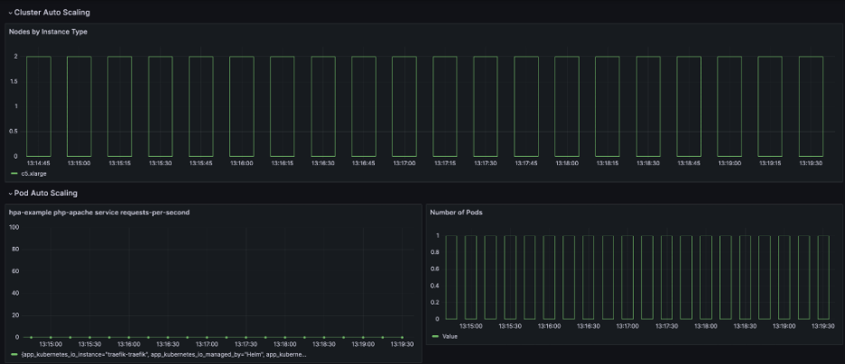<br/> 
Fig. 8 - Cluster Auto-scaling Dashboard with no load
</center>
<br/>

We have one system node, one service pod and 0 requests per second.<br/>
Note: If you are running the experiment for the first time, the requests-per-second panel may display “no data available”. This is expected. You may proceed to the next step to allow a few minutes for data to be collected. If the panel is still blank, plese click on the data label at the bottom of the panel to ensure the series is displayed. If there is still no data, please edit the panel and review the prometheus query in code or builder mode to ensure that it returns rate data.

## 3.6. Deploy load generator

```bash
kubectl apply -f ./load-generator.yaml
```

<details>
    <summary>Output:</summary>

    /eks/deployment/horizontal-pod-autoscaler/hpa-example# kubectl apply -f ./load-generator.yaml
    deployment.apps/load-generator created

</details>
<br/>

This starts a single load-generating pod which sends a request to the service repeatedly at a millisecond interval.

The dashboard shows a raise in the request rate per second and KEDA spins up more instances of our service pods to be able to serve the increased number of request.

<center>
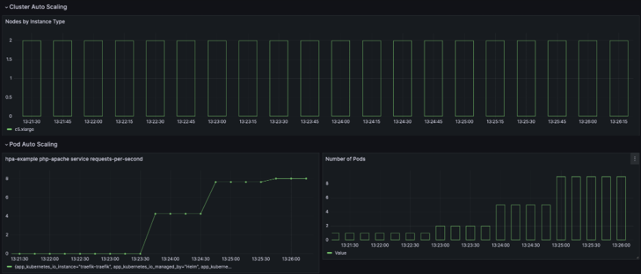<br/>
Fig. 9 - Horizontal Pod Autoscaling via KEDA
</center>
<br/>
Note that all pods fit on the current system pod nodes, so no new nodes were added to the cluster.

## 3.7. Scale out

```bash
./scale.sh load-generator 40
```

You will see more service pods and nodes elasticaly added to the cluster.

<details>
    <summary>Output:</summary>

    /eks/deployment/horizontal-pod-autoscaler/hpa-example# ./scale.sh load-generator 40

    Scaling deployment load-generator to 40 replicas ...
    deployment.apps/load-generator scaled

</details>
<br/>

Since the number of load generator pods increases, the requests per second sent to the service is increased. KEDA creates more pods to allow the increased load to be handled. Some of the service pods enter the “Pending” state because the existing nodes cannot accommodate them. As soon as Karpenter detects “Pending” pods, it adds more nodes to the cluster. Thus, we have horizontally scaled both our pods and nodes.

<center>
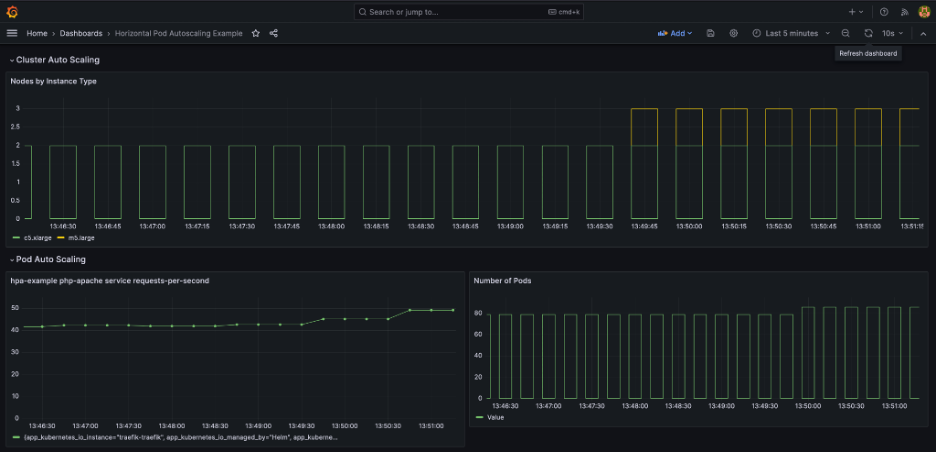<br/>
Fig. 10 - Node autoscaling via Karpenter
</center>
<br/>

Autoscaling continues until all scaled pods become Running and the requests from all load generators are handled by the service pods:

<center>
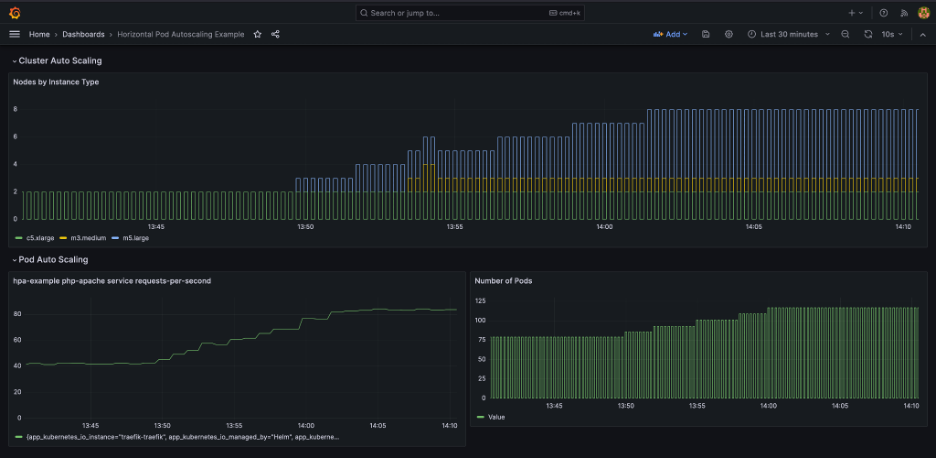<br/>
Fig. 11 - Autoscaling in horizontal and vertical direction
</center>
<br/>

To zoom out, use the time-range selector.

## 3.8. Scale in

```bash
./scale.sh load-generator 1
```

<details>
    <summary>Output:</summary>


    eks/deployment/horizontal-pod-autoscaler/hpa-example# ./scale.sh load-generator 1

    Scaling deployment load-generator to 1 replicas ...
    deployment.apps/load-generator scaled

</details>
<br/>

The cluster will automatically scale in since requests are being sent only by the original pod.

The Grafana dashboard shows the reduction in request per second, service pods and cluster nodes.

<center>
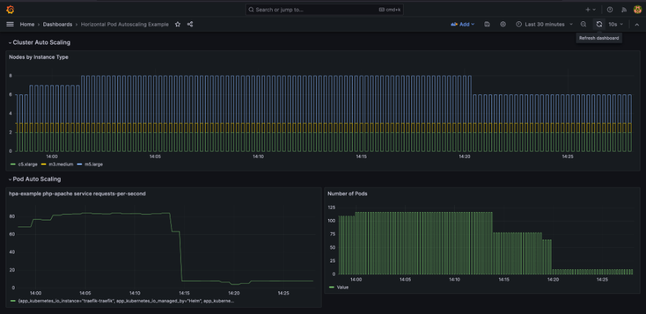<br/> 
Fig. 12 - Scaling in
</center>
<br/>

Note that the number of remaining nodes in the cluster does not necessarily match the number of nodes in the beginning of the experiment. The number of nodes in the cluster is controlled by Karpenter. The Karpenter provisioner may be configured to relocate pods in order to minimize the number of running nodes.

# 4. Scaling out GPU workloads

The same approach as described in section 3 can be applied when scaling out GPU workloads. Let's again use the same "requests per second" metric, but this time specify that our workload pods require one NVIDIA GPU each. 

## 4.1. Update deployment
We'll add `nvidia.com/gpu: 1` to the resource limits and requests of our example deployment manifest `php-apache.yaml-template` located in `/eks/deployment/horizontal-pod-autoscaler/hpa-example` within the `aws-do-eks` container:

```yaml
---
apiVersion: apps/v1
kind: Deployment
metadata:
  name: php-apache
  namespace: hpa-example
spec:
  selector:
    matchLabels:
      run: php-apache
  replicas: 1
  template:
    metadata:
      labels:
        run: php-apache
    spec:
      containers:
      - name: php-apache
        image: ${REGISTRY}${IMAGE}${TAG}
        ports:
        - containerPort: 80
        resources:
          limits:
            cpu: 500m
            nvidia.com/gpu: 1
          requests:
            cpu: 200m
            nvidia.com/gpu: 1
---
apiVersion: v1
kind: Service
metadata:
  name: php-apache
  namespace: hpa-example
  labels:
    run: php-apache
spec:
  ports:
  - name: web
    port: 80
  selector:
    run: php-apache
```

Then execute `./run.sh` to update the deployment.

```bash
./run.sh
```
<details>
    <summary>Output:</summary>

    Generating manifest from template php-apache.yaml-template ...

    Applying base manifests ...
    namespace/hpa-example unchanged
    deployment.apps/php-apache configured
    service/php-apache unchanged

</details>
</br>

## 4.2. Deploy NVIDIA device plugin
The NVIDIA device plugin is needed to enable the cluster to recognize nodes that have available GPU resources and schedule pods that require GPUs on those nodes.

To deploy the NVIDIA device plugin execute, from the `aws-do-eks` shell execute:

```bash
pushd /eks/deployment/nvidia-device-plugin
./deploy.sh
popd
```

<details>
    <summary>Output:</summary>
    daemonset.apps/nvidia-device-plugin-daemonset created
</details>
<br/>

Use the following command to check the status of the device plugin:

```bash
kubectl -n kube-system get daemonset
```

<details>
    <summary>Output:</summary>

    NAMESPACE     NAME                                  DESIRED   CURRENT   READY   UP-TO-DATE   AVAILABLE   NODE SELECTOR              AGE
    kube-system   aws-node                              8         8         8       8            8           <none>                     4d21h
    kube-system   ebs-csi-node                          8         8         8       8            8           kubernetes.io/os=linux     4d21h
    kube-system   kube-proxy                            8         8         8       8            8           <none>                     4d21h
    kube-system   nvidia-device-plugin-daemonset        8         8         8       8            8           <none>                     8s
    prometheus    prometheus-prometheus-node-exporter   8         8         8       8            8           kubernetes.io/os=linux     92m

</details>
<br/>

Upon successful deployment you would see that the number of "Ready" pods from daemonset `nvidia-device-plugin-daemonset` is equal to the number of "Desired" pods.

## 4.3. Scale

To scale out the cluster, simply increase the number of replicas of the load generator pod.

```bash
./scale.sh load-generator 40
```

The number of requests to our example service increases. KEDA scales the service deployment accordingly, adding more pods. The pods require one GPU each. Since there aren't enough GPUs in the cluster to run the new pods, these pods remain in "Pending" state. Karpenter notices the pending pods and adds GPU nodes to the cluster. As soon as these nodes become "Ready", the nvidia-device-plugin daemonset runs on them and the GPUs get advertised in the cluster. The Kubernetes pod scheduler matches the "Pending" pods against the new nodes with available GPUs, and these pods enter the "ContainerCreating", followed by "Running" state.

<center>
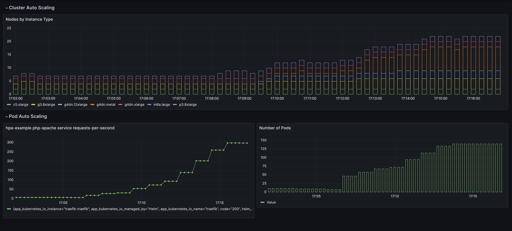<br/>
Fig. 13 - GPU nodes scaled out
</center>
<br/>

As can be seen from the legend of the top dashboard pane, Karpenter added `g3.8xlarge`, `g4dn.xlarge`, `g4dn.12xlarge`, `g4dn.metal`, and `p3.8xlarge` GPU nodes to the cluster. You may further restrict or widen the families of node types that Karpenter is allowed to use for GPU workloads by modifying the Karpenter provisioner or set of provisioners. 

To scale in the cluster, simply reduce the number of load generator pods back to 1.

```bash
./scale.sh load-generator 1
```

<center>
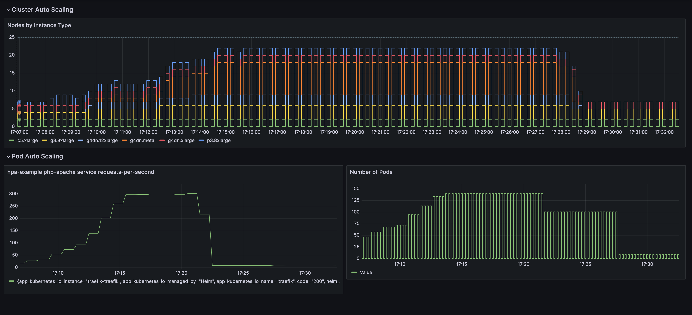<br/>
Fig. 14 - GPU nodes scaled in
</center>
<br/>


# 5. Clean up

If you created an EKS cluster following the steps from the previous sections, to clean up, you can delete the deployments and the EKS cluster by executing the following in the `aws-do-eks` container shell:

```bash
pushd /eks
kubectl delete deployment -A --all
./eks-delete.sh
popd
```

<details>
    <summary>Output:</summary>

    /eks# pushd /eks
    /eks /eks
    /eks# kubectl delete deployment -A --all
    deployment.apps "grafana" deleted
    deployment.apps "load-generator" deleted
    deployment.apps "php-apache" deleted
    deployment.apps "karpenter" deleted
    deployment.apps "keda-admission-webhooks" deleted
    deployment.apps "keda-operator" deleted
    deployment.apps "keda-operator-metrics-apiserver" deleted
    deployment.apps "coredns" deleted
    deployment.apps "ebs-csi-controller" deleted
    deployment.apps "prometheus-kube-state-metrics" deleted
    deployment.apps "prometheus-prometheus-pushgateway" deleted
    deployment.apps "prometheus-server" deleted
    deployment.apps "traefik" deleted

    /eks# ./eks-delete.sh
    /eks/impl/eksctl/yaml /eks

    ./eks-delete.sh


    Deleting cluster using /eks/conf/eksctl/yaml/eks-karpenter.yaml ...

    eksctl delete cluster -f /eks/conf/eksctl/yaml/eks-karpenter.yaml

    2023-08-05 04:42:36 [ℹ]  deleting EKS cluster "do-eks-yaml-karpenter"
    2023-08-05 04:42:37 [ℹ]  will drain 0 unmanaged nodegroup(s) in cluster "do-eks-yaml-karpenter"
    2023-08-05 04:42:37 [ℹ]  starting parallel draining, max in-flight of 1
    2023-08-05 04:42:37 [ℹ]  cordon node "ip-192-168-114-25.us-west-2.compute.internal"
    2023-08-05 04:42:37 [ℹ]  cordon node "ip-192-168-172-32.us-west-2.compute.internal"

    2023-08-05 04:46:54 [✔]  drained all nodes: [ip-192-168-172-32.us-west-2.compute.internal ip-192-168-114-25.us-west-2.compute.internal]
    2023-08-05 04:46:54 [ℹ]  deleted 0 Fargate profile(s)
    2023-08-05 04:46:54 [✔]  kubeconfig has been updated
    2023-08-05 04:46:54 [ℹ]  cleaning up AWS load balancers created by Kubernetes objects of Kind Service or Ingress
    2023-08-05 04:46:55 [ℹ]  
    3 sequential tasks: { delete nodegroup "c5-xl-do-eks-karpenter-ng", 
        2 sequential sub-tasks: { 
            2 parallel sub-tasks: { 
                2 sequential sub-tasks: { 
                    delete IAM role for serviceaccount "karpenter/karpenter",
                    delete serviceaccount "karpenter/karpenter",
                },
                2 sequential sub-tasks: { 
                    delete IAM role for serviceaccount "kube-system/aws-node",
                    delete serviceaccount "kube-system/aws-node",
                },
            },
            delete IAM OIDC provider,
        }, delete cluster control plane "do-eks-yaml-karpenter" [async] 
    }
    2023-08-05 04:46:55 [ℹ]  will delete stack "eksctl-do-eks-yaml-karpenter-nodegroup-c5-xl-do-eks-karpenter-ng"
    2023-08-05 04:46:55 [ℹ]  waiting for stack "eksctl-do-eks-yaml-karpenter-nodegroup-c5-xl-do-eks-karpenter-ng" to get deleted
    2023-08-05 04:46:55 [ℹ]  waiting for CloudFormation stack "eksctl-do-eks-yaml-karpenter-nodegroup-c5-xl-do-eks-karpenter-ng"

</details>
<br/>

# 6. Conclusion
We applied the same generic approach to scale both CPU and GPU workloads on Amazon EKS based on a custom metric. The auto-scaling example provided here is generic and can be utilized by any workload that has variable resource requirements, based on appropriate custom metrics. Workloads such as ML model inference, data simulation, batch processing jobs, etc. require auto-scaling because they are typically spiky in nature and it is difficult to predict their resource requirements and timing. The use of auto-scaling ensures that custer resources are allocated when needed and removed when not in use, thus maximizing utilization and minimizing cost.
